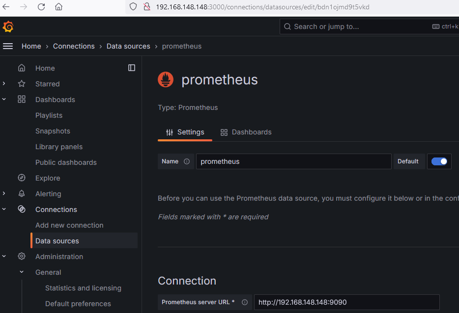

# PROCEDIMIENTO DEL CHALLENGE 01 EN LAB DE WHITESTACK

## PASO 0: PROBAR ACCESOS

En un Linux local con sistema operativo Ubuntu 22 se copió el archivo "challenger-004.yaml" y luego se ejecutó el siguiente comando :

```
eduardo@vm:~/challenge2$ export KUBECONFIG="/home/azureuser/whitestackchallenge.yaml"
eduardo@vm:~/challenge2$ kubectl get pods
Warning: Use tokens from the TokenRequest API or manually created secret-based tokens instead of auto-generated secret-based tokens.
No resources found in challenger-004 namespace.
eduardo@vm:~/challenge2$
```
En dicho Linux se usó `kubectl get pods` y se verificó exitosamente la comunicación con el Kubernetes remoto.


## PASO 1: DESPLEGAR APLICACIÓN WEB

En un Linux local con sistema operativo Ubuntu 22 se clonó la aplicación NGINX

```
eduardo@vm:~$ git clone https://github.com/gespinozat/ws-challenge-2.git
Cloning into 'ws-challenge-2'...
remote: Enumerating objects: 15, done.
remote: Counting objects: 100% (15/15), done.
remote: Compressing objects: 100% (13/13), done.
remote: Total 15 (delta 3), reused 14 (delta 2), pack-reused 0
Receiving objects: 100% (15/15), 7.78 KiB | 2.59 MiB/s, done.
Resolving deltas: 100% (3/3), done.

eduardo@vm:~$ cd ws-challenge-2/
eduardo@vm:~/ws-challenge-2$ kubectl apply -f nginx.yaml
networkpolicy.networking.k8s.io/nginx created
serviceaccount/nginx created
secret/nginx-tls created
service/nginx created
deployment.apps/nginx created

eduardo@vm:~/ws-challenge-2$ kubectl get pods
NAME                     READY   STATUS    RESTARTS   AGE
nginx-6bff48bf56-rzz88   0/2     Running   0          3s

eduardo@vm:~/ws-challenge-2$ kubectl get pods
NAME                     READY   STATUS    RESTARTS   AGE
nginx-6bff48bf56-rzz88   2/2     Running   0          10s

eduardo@vm:~/ws-challenge-2$ kubectl get all
NAME                         READY   STATUS    RESTARTS   AGE
pod/nginx-6bff48bf56-rzz88   2/2     Running   0          20s

NAME                 TYPE           CLUSTER-IP       EXTERNAL-IP   PORT(S)                       AGE
service/kubernetes   ClusterIP      10.96.0.1        <none>        443/TCP                       30h
service/nginx        LoadBalancer   10.111.250.140   <pending>     80:32149/TCP,9113:31623/TCP   20s

NAME                    READY   UP-TO-DATE   AVAILABLE   AGE
deployment.apps/nginx   1/1     1            1           20s

NAME                               DESIRED   CURRENT   READY   AGE
replicaset.apps/nginx-6bff48bf56   1         1         1       20s
```


## PASO 2: CREAR SERVICE MONITOR PARA OBTENCIÓN DE MÉTRICAS

Se creó el archivo sm-whitestack.yaml que se aplicó para crear el service monitor

```
eduardo@vm:~$ kubectl get service/kube-prometheus-stack-kube-state-metrics -o yaml -n monitoring | grep release
Warning: Use tokens from the TokenRequest API or manually created secret-based tokens instead of auto-generated secret-based tokens.
    meta.helm.sh/release-name: kube-prometheus-stack
    meta.helm.sh/release-namespace: monitoring
    release: kube-prometheus-stack

eduardo@vm:~$ more sm-whitestack.yaml
apiVersion: monitoring.coreos.com/v1
kind: ServiceMonitor
metadata:
  name: nginx-sm
  labels:
    app: nginx-sm
    release: kube-prometheus-stack
spec:
  selector:
    matchLabels:
      app.kubernetes.io/instance: nginx
      app.kubernetes.io/name: nginx
  endpoints:
  -  port: metrics
     interval: 5s

eduardo@vm:~$ kubectl apply -f sm-whitestack.yaml
Warning: Use tokens from the TokenRequest API or manually created secret-based tokens instead of auto-generated secret-based tokens.
servicemonitor.monitoring.coreos.com/nginx-sm created
```

Se publica el puerto 9090 de Prometheus. Luego se usa un navegador y se valida que la web de Prometheus muestra que el target de nginx fue creado exitosamente y permite monitorear las metrics de nginx.

```
eduardo@vm:~$ kubectl port-forward service/kube-prometheus-stack-prometheus 9090 --address="0.0.0.0" -n monitoring
Warning: Use tokens from the TokenRequest API or manually created secret-based tokens instead of auto-generated secret-based tokens.
Forwarding from 0.0.0.0:9090 -> 9090
```

## PASO 3: DESPLEGAR GRAFANA E INTEGRARLO CON PROMETHEUS

En un server local con Ubuntu 22 se desplegó Grafana usando docker

```
eduardo@vm:~$ sudo docker ps
CONTAINER ID   IMAGE     COMMAND   CREATED   STATUS    PORTS     NAMES

eduardo@vm:~$ sudo docker run -d -p 3000:3000 --name=grafana grafana/grafana-enterprise
Unable to find image 'grafana/grafana-enterprise:latest' locally
latest: Pulling from grafana/grafana-enterprise
4abcf2066143: Pull complete
72db4ea52f68: Pull complete
5d7c6f7faf4f: Pull complete
9213063c7a06: Pull complete
f5d9b74cdbda: Pull complete
7f3c05061126: Pull complete
1304d6cda511: Pull complete
ec80b701a02f: Pull complete
d55f36d32694: Pull complete
9535f245c480: Pull complete
Digest: sha256:07f0df051f77a6500f96db6f3b75469bf4003a80ffed7f30972c70db42cca9af
Status: Downloaded newer image for grafana/grafana-enterprise:latest
be221031715c8454bb601d5c44fa2890160f776be6c20fc4210dba7e052fce2e

eduardo@vm:~$ sudo docker ps
CONTAINER ID   IMAGE                        COMMAND     CREATED              STATUS              PORTS                                       NAMES
be221031715c   grafana/grafana-enterprise   "/run.sh"   About a minute ago   Up About a minute   0.0.0.0:3000->3000/tcp, :::3000->3000/tcp   grafana
```

Hacemos port forward a Prometheus para que después pueda ser accedido por Grafana

```
eduardo@vm:~$ kubectl port-forward svc/kube-prometheus-stack-prometheus 9090 --address="0.0.0.0" -n monitoring
Warning: Use tokens from the TokenRequest API or manually created secret-based tokens instead of auto-generated secret-based tokens.
Forwarding from 0.0.0.0:9090 -> 9090
Handling connection for 9090
```

Ingresamos a Grafana usando la dirección IP del servidor local, en este caso es http://192.168.148.148:3000

En Grafana en el menú "Connections \ Datasource"  agregamos un datasource de tipo Prometheus. En el campo "Prometheus server URL" escribimos http://192.168.148.148:9090.  Dejamos por defecto todos los demás campos y guardamos el datasource.



